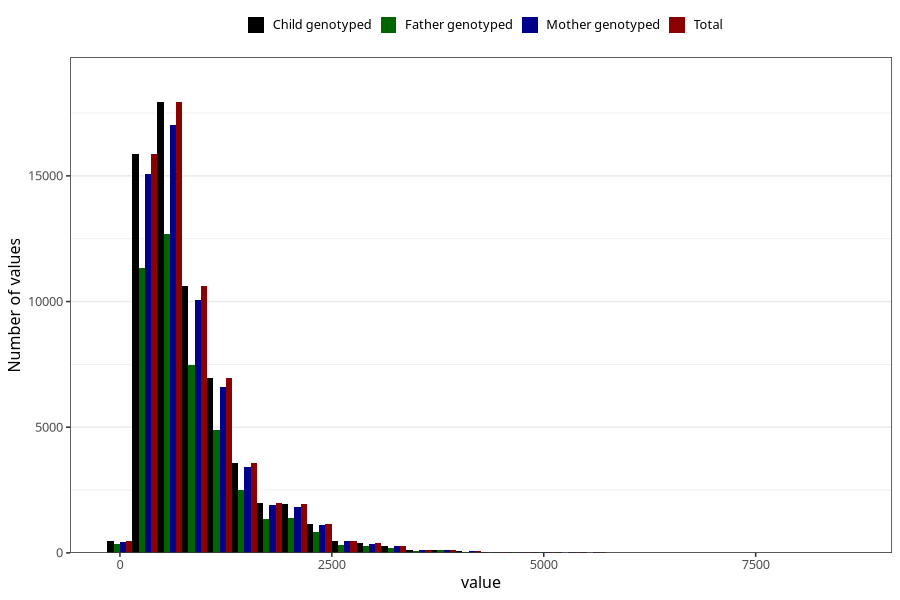

# retinol
Variable mapping to `RETINOL` in `Skjema2_beregning_CDW_v12`.
- Number of values:

| Value | Total | Child genotyped | Mother genotyped | Father genotyped |
| ----- | ----- | --------------- | ---------------- | ---------------- |
| Missing | 13178 | 13178 | 12654 | 6217 |
| Non-missing | 62130 | 62130 | 58996 | 43867 |
| 25th percentile | 429.2025 | 429.2025 | 429.01 | 426.49 |
| 50th percentile | 667.56 | 667.56 | 667.08 | 661.68 |
| 75th percentile | 1089.81 | 1089.81 | 1089.5875 | 1080.415 |
| Mean | 860.967564944471 | 860.967564944471 | 860.232740185775 | 854.393566918185 |
| Standard deviation | 645.85362585768 | 645.85362585768 | 644.701028242677 | 640.25738265961 |
| N | 62130 | 62130 | 58996 | 43867 |

