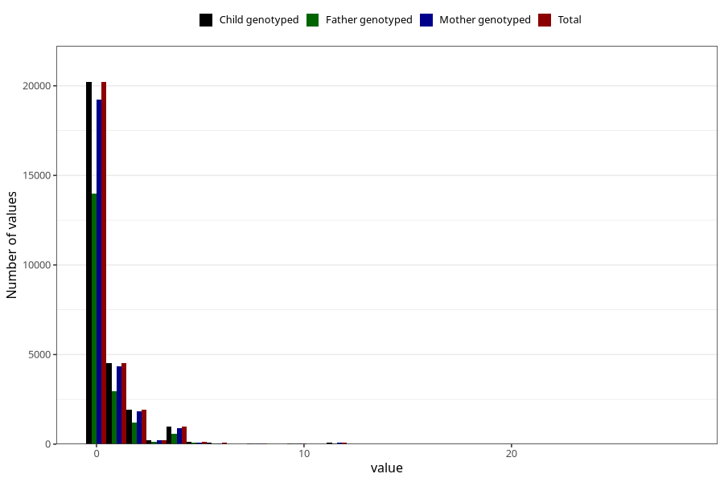

# soda_before
Variable mapping to `AA1395` in `Skjema1_v12`.
- Number of values:

| Value | Total | Child genotyped | Mother genotyped | Father genotyped |
| ----- | ----- | --------------- | ---------------- | ---------------- |
| Missing | 47080 | 47080 | 44788 | 31018 |
| Non-missing | 28228 | 28228 | 26862 | 19066 |
| Consumption have been reported by a mark but no amount given | 2 | 2 | 2 |1 |
| 25th percentile | 0 | 0 | 0 | 0 |
| 50th percentile | 0 | 0 | 0 | 0 |
| 75th percentile | 1 | 1 | 1 | 1 |
| Mean | 0.56083044001984 | 0.56083044001984 | 0.557818317200298 | 0.513296616837136 |
| Standard deviation | 1.29836108634004 | 1.29836108634004 | 1.28147419426014 | 1.22193374561104 |
| N | 28226 | 28226 | 26860 | 19065 |

