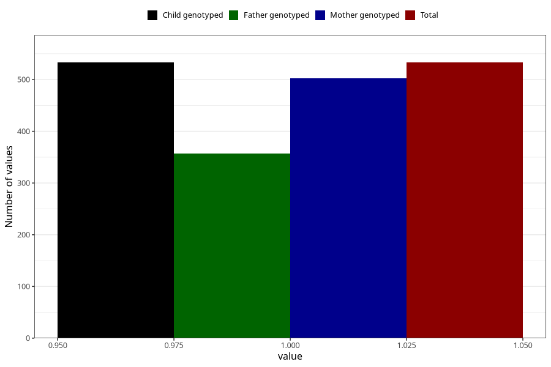

# soda_decaf
Variable mapping to `AA1397` in `Skjema1_v12`.
- Number of values:

| Value | Total | Child genotyped | Mother genotyped | Father genotyped |
| ----- | ----- | --------------- | ---------------- | ---------------- |
| Missing | 74775 | 74775 | 71147 | 49727 |
| Non-missing | 533 | 533 | 503 | 357 |
| 1 | 533 | 533 | 503 | 357 |

