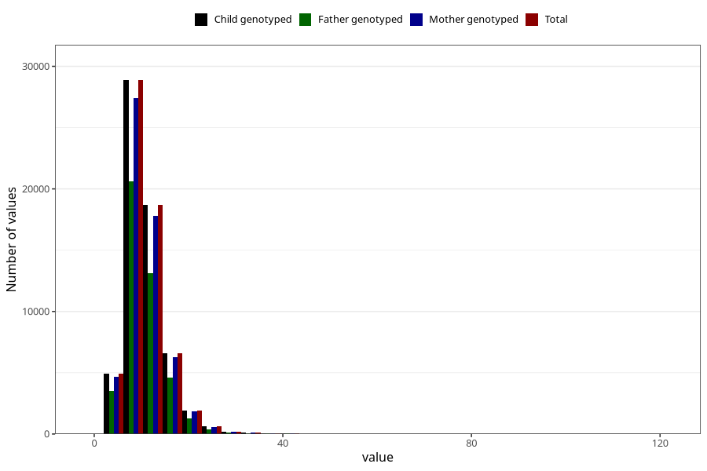

# vitamin_ed
Variable mapping to `VIT_E` in `Skjema2_beregning_CDW_v12`.
- Number of values:

| Value | Total | Child genotyped | Mother genotyped | Father genotyped |
| ----- | ----- | --------------- | ---------------- | ---------------- |
| Missing | 13178 | 13178 | 12654 | 6217 |
| Non-missing | 62130 | 62130 | 58996 | 43867 |
| 25th percentile | 7.94 | 7.94 | 7.94 | 7.89 |
| 50th percentile | 9.98 | 9.98 | 9.98 | 9.92 |
| 75th percentile | 12.77 | 12.77 | 12.75 | 12.68 |
| Mean | 10.8646533075809 | 10.8646533075809 | 10.8562287273713 | 10.7829085645246 |
| Standard deviation | 4.49480618965038 | 4.49480618965038 | 4.48592200509272 | 4.44045506244961 |
| N | 62130 | 62130 | 58996 | 43867 |

