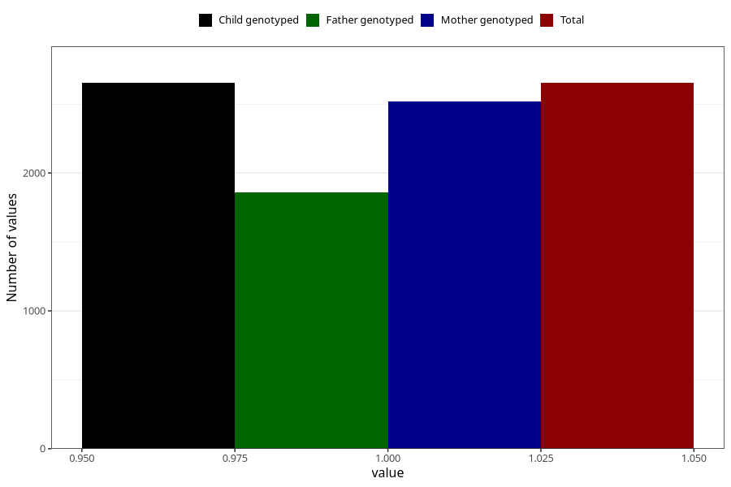

# contraception_used_other
Variable mapping to `AA39` in `Skjema1_v12`.
- Number of values:

| Value | Total | Child genotyped | Mother genotyped | Father genotyped |
| ----- | ----- | --------------- | ---------------- | ---------------- |
| Missing | 72655 | 72655 | 69134 | 48224 |
| Non-missing | 2653 | 2653 | 2516 | 1860 |
| 1 | 2653 | 2653 | 2516 | 1860 |

