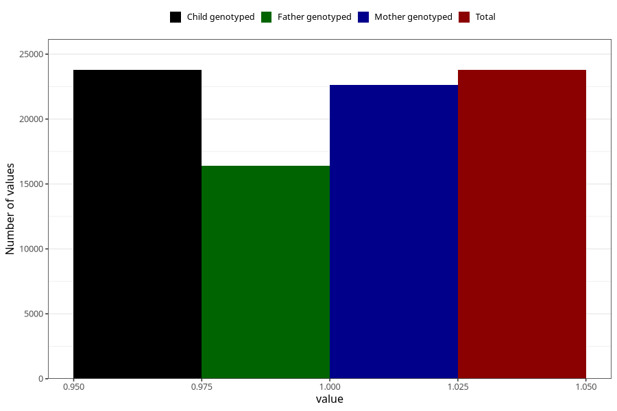

# contraception_used_pill
Variable mapping to `AA34` in `Skjema1_v12`.
- Number of values:

| Value | Total | Child genotyped | Mother genotyped | Father genotyped |
| ----- | ----- | --------------- | ---------------- | ---------------- |
| Missing | 51529 | 51529 | 48996 | 33694 |
| Non-missing | 23779 | 23779 | 22654 | 16390 |
| 1 | 23779 | 23779 | 22654 | 16390 |

