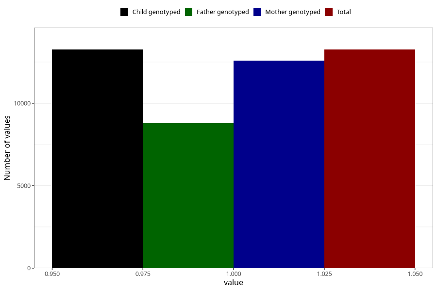

# contraception_used_withdrawal
Variable mapping to `AA37` in `Skjema1_v12`.
- Number of values:

| Value | Total | Child genotyped | Mother genotyped | Father genotyped |
| ----- | ----- | --------------- | ---------------- | ---------------- |
| Missing | 62052 | 62052 | 59079 | 41281 |
| Non-missing | 13256 | 13256 | 12571 | 8803 |
| 1 | 13256 | 13256 | 12571 | 8803 |

