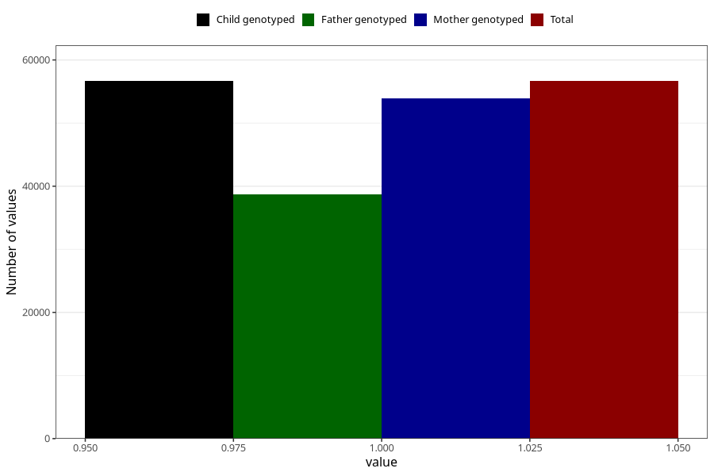

# lost_periods_no
Variable mapping to `AA17` in `Skjema1_v12`.
- Number of values:

| Value | Total | Child genotyped | Mother genotyped | Father genotyped |
| ----- | ----- | --------------- | ---------------- | ---------------- |
| Missing | 18654 | 18654 | 17746 | 11380 |
| Non-missing | 56654 | 56654 | 53904 | 38704 |
| 1 | 56654 | 56654 | 53904 | 38704 |

