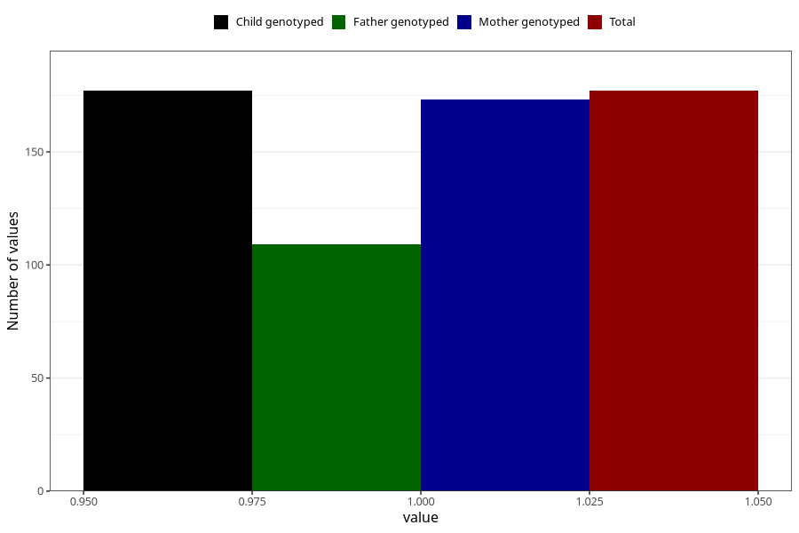

# treated_for_infertility_fallopian_tube_suregery
Variable mapping to `AA69` in `Skjema1_v12`.
- Number of values:

| Value | Total | Child genotyped | Mother genotyped | Father genotyped |
| ----- | ----- | --------------- | ---------------- | ---------------- |
| Missing | 75131 | 75131 | 71477 | 49975 |
| Non-missing | 177 | 177 | 173 | 109 |
| 1 | 177 | 177 | 173 | 109 |

