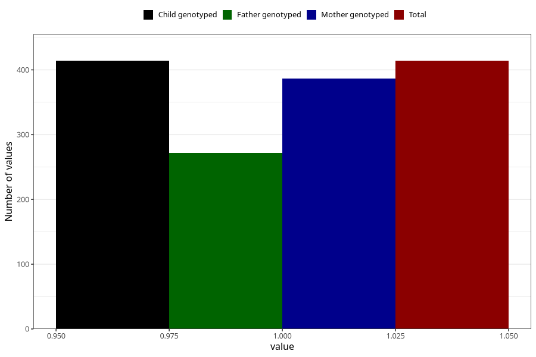

# treated_for_infertility_other
Variable mapping to `AA81` in `Skjema1_v12`.
- Number of values:

| Value | Total | Child genotyped | Mother genotyped | Father genotyped |
| ----- | ----- | --------------- | ---------------- | ---------------- |
| Missing | 74894 | 74894 | 71263 | 49812 |
| Non-missing | 414 | 414 | 387 | 272 |
| 1 | 414 | 414 | 387 | 272 |

