# Phenotypes
### Number of values
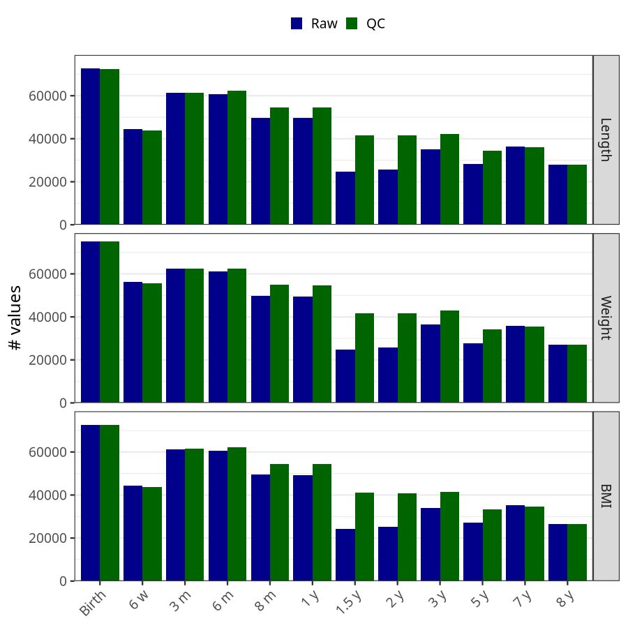
### Length vs weight
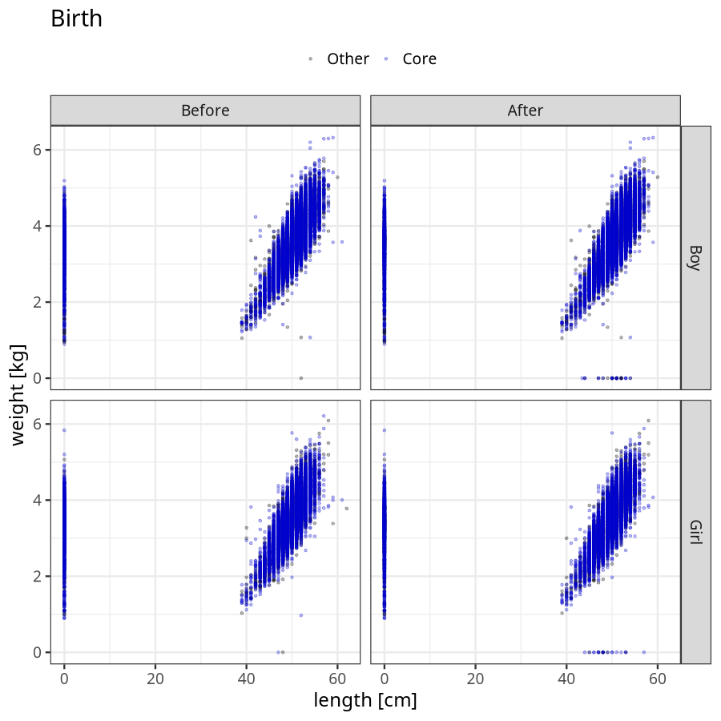

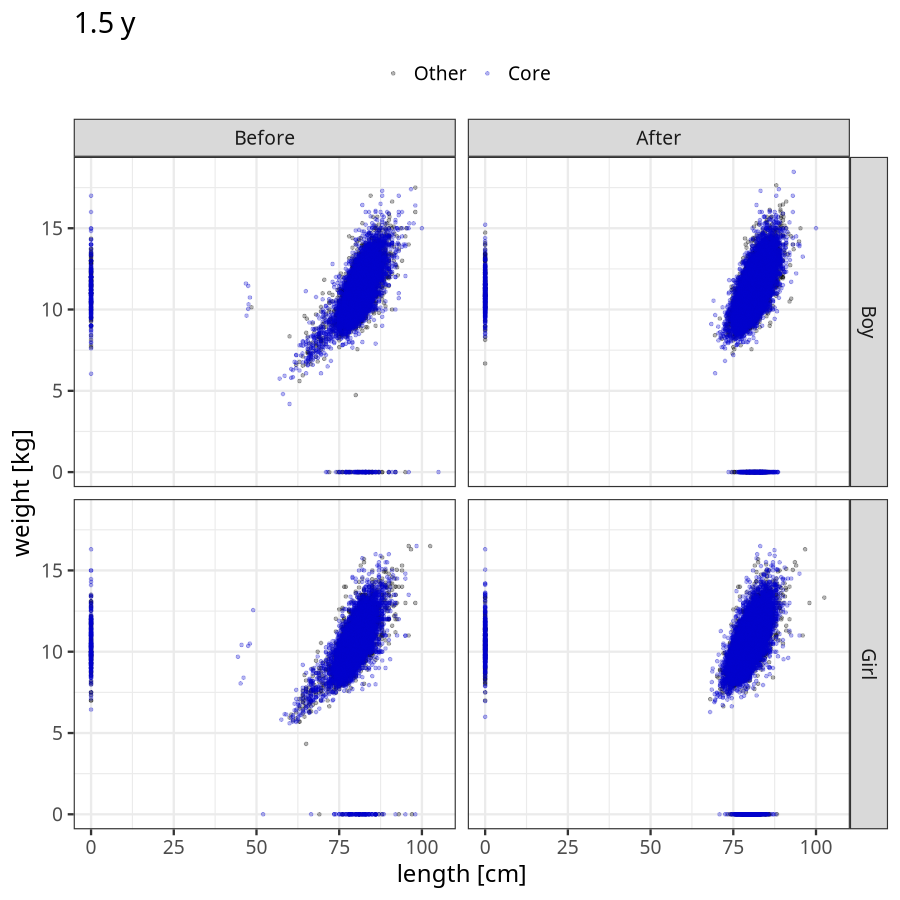

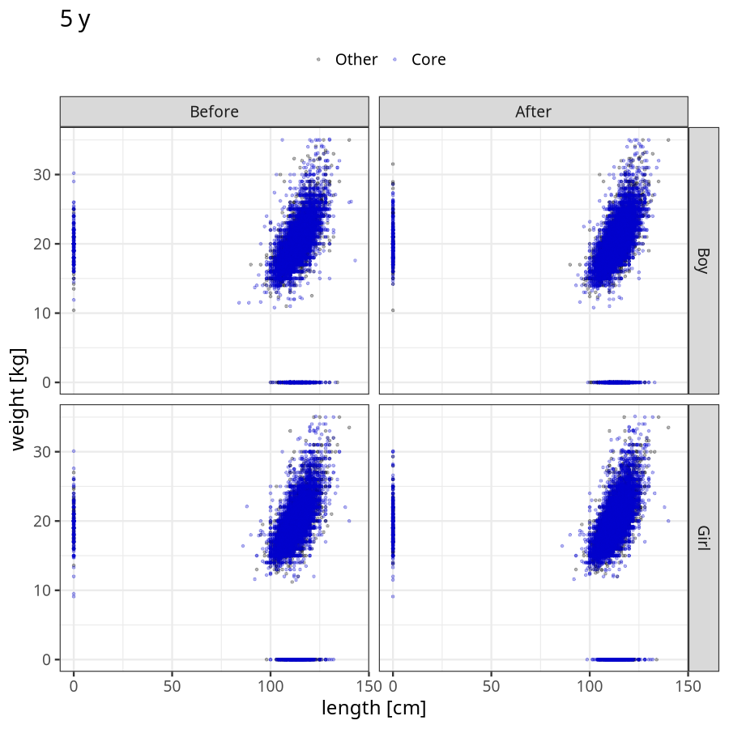

### Imputation
- Children with no data point altered: 43024
- Children with at least one data point altered: 32265
#### Random example: 24912
> outlier@length_2y imputed@length_2y

#### Random example: 8004
> outlier@length_2y imputed@length_2y

#### Random example: 24357
> outlier@length_2y imputed@length_2y

#### Random example: 54046
> outlier@length_2y imputed@length_2y

#### Random example: 40451
> outlier@length_2y imputed@length_2y

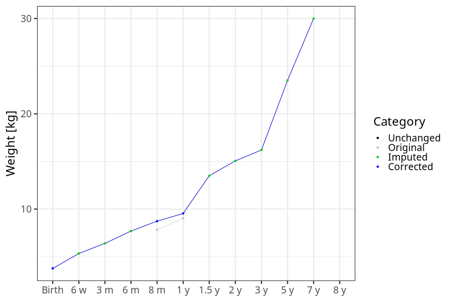
#### Random example: 24193
> outlier@length_2y imputed@length_2y

#### Random example: 52806
> outlier@length_2y imputed@length_2y

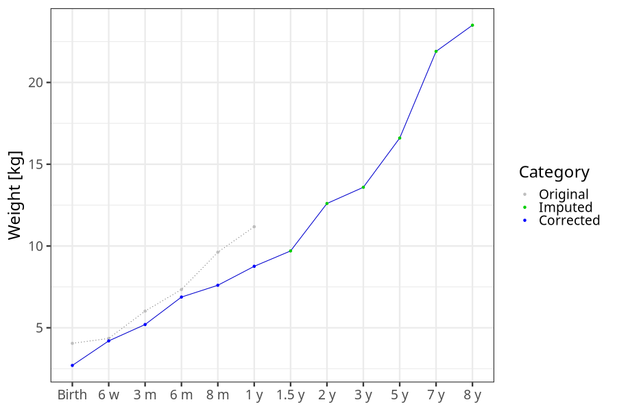
#### Random example: 48434
> outlier@length_2y imputed@length_2y

#### Random example: 47413
> outlier@length_2y imputed@length_2y

#### Random example: 36929
> outlier@length_2y imputed@length_2y

#### Random example: 27729
> outlier@length_2y imputed@length_2y

#### Random example: 48806
> outlier@length_2y imputed@length_2y

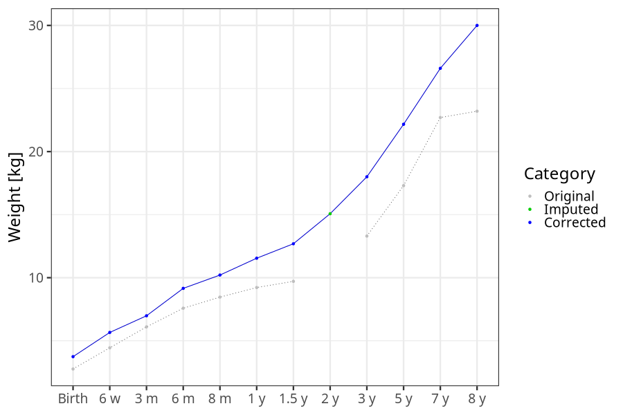
#### Random example: 32874
> outlier@length_2y imputed@length_2y

#### Random example: 37517
> outlier@length_2y imputed@length_2y

#### Random example: 23676
> outlier@length_2y imputed@length_2y

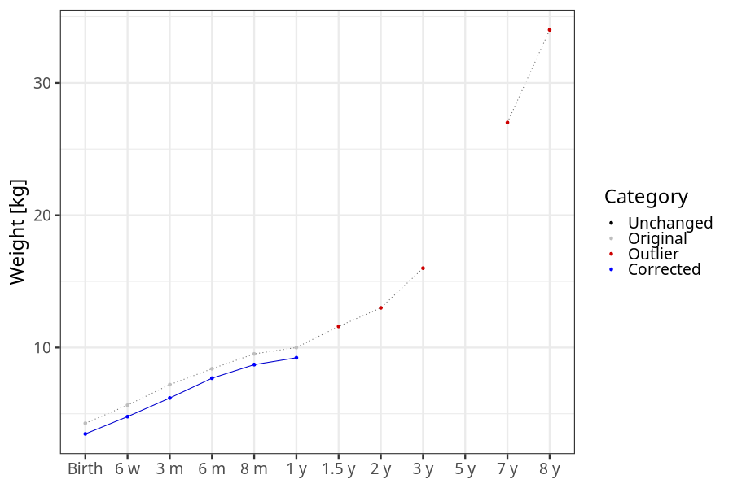
#### Random example: 50557
> outlier@length_2y imputed@length_2y

#### Random example: 52839
> outlier@length_2y imputed@length_2y

#### Random example: 63670
> outlier@length_2y imputed@length_2y

#### Random example: 4826
> outlier@length_2y imputed@length_2y

#### Random example: 10582
> outlier@length_2y imputed@length_2y

#### Most extreme example (1): 67761
> 

#### Most extreme example (2): 7126
> imputed@length_16m imputed@length_2y imputed@weight_16m imputed@weight_2y

#### Most extreme example (3): 48903
> 
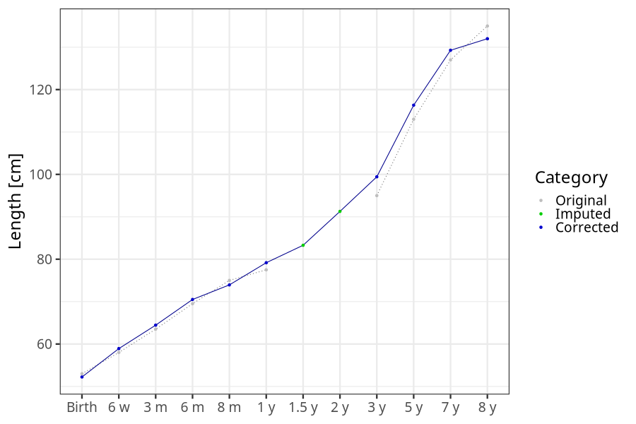

#### Most extreme example (4): 66037
> imputed@length_8m imputed@length_1y imputed@length_16m imputed@weight_8m imputed@weight_1y imputed@weight_16m

#### Most extreme example (5): 60746
> outlier@length_2y imputed@length_2y
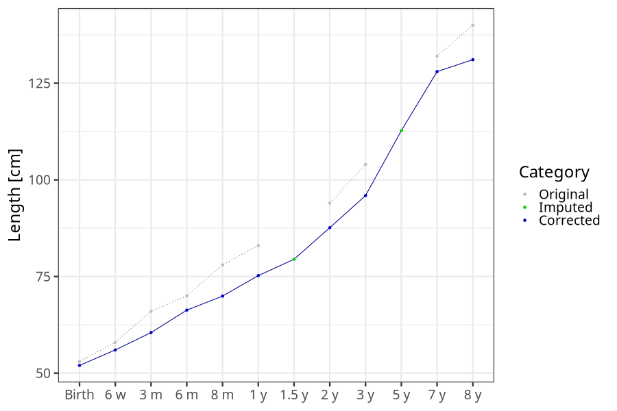

#### Most extreme example (6): 46554
> 

#### Most extreme example (7): 66319
> imputed@weight_6m imputed@weight_8m imputed@weight_16m

#### Most extreme example (8): 45389
> imputed@length_16m imputed@length_2y imputed@weight_16m imputed@weight_2y

#### Most extreme example (9): 13082
> outlier@weight_1y imputed@weight_1y imputed@weight_2y

#### Most extreme example (10): 74957
> 

#### Most extreme example (11): 40384
> imputed@length_16m imputed@length_2y imputed@weight_16m imputed@weight_2y

#### Most extreme example (12): 65081
> 

#### Most extreme example (13): 197
> imputed@length_8m imputed@length_1y imputed@length_16m imputed@length_2y imputed@length_5y

#### Most extreme example (14): 47378
> imputed@length_16m imputed@weight_16m imputed@weight_5y

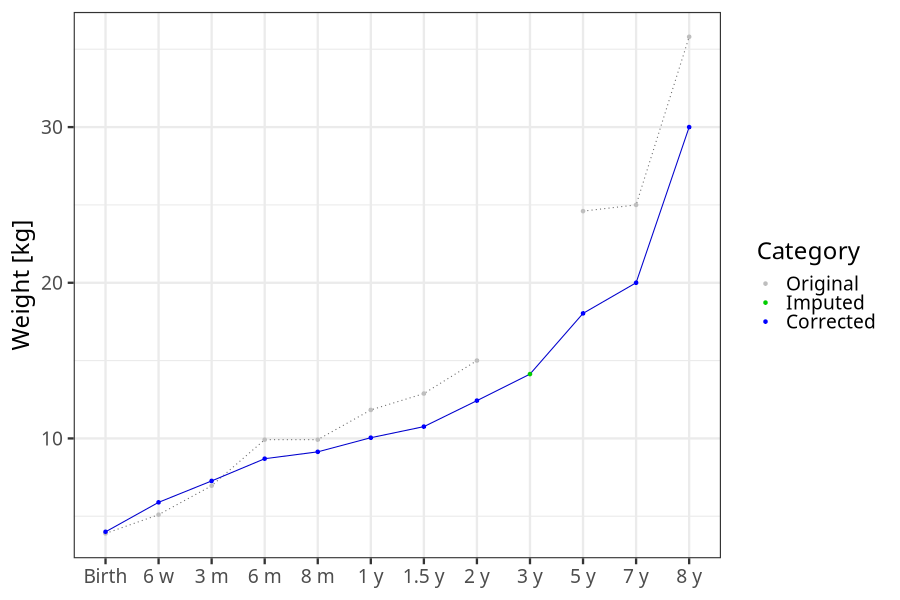
#### Most extreme example (15): 21863
> imputed@length_16m imputed@length_2y imputed@length_3y imputed@weight_16m imputed@weight_2y imputed@weight_3y

#### Most extreme example (16): 7007
> 

#### Most extreme example (17): 42856
> 

#### Most extreme example (18): 4857
> imputed@length_16m imputed@length_2y imputed@length_5y imputed@weight_16m imputed@weight_2y imputed@weight_5y outlier@weight_8y

#### Most extreme example (19): 43905
> 

#### Most extreme example (20): 32292
> imputed@length_3y imputed@length_5y imputed@weight_3y imputed@weight_5y outlier@length_8y

