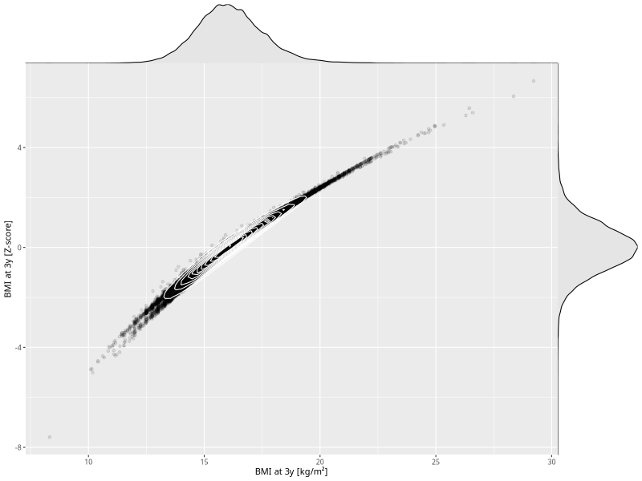

## BMI at 3y

| Name | # Children | # Mothers | # Fathers | # Total |
| ---- | ---------- | --------- | --------- | ------- |
| bmi_3y | 41384 | 39283 | 28967 | 109634 |
| z_bmi_3y | 41384 | 39283 | 28967 | 109634 |

- Formula: `bmi_3y ~ fp(pregnancy_duration_1)`
- Sigma formula: ` ~ pregnancy_duration_1`
- Distribution: `LOGNO`
- Normalization: `centiles.pred` Z-scores

