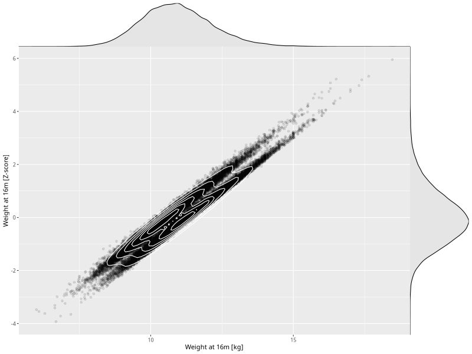

## Weight at 16m

| Name | # Children | # Mothers | # Fathers | # Total |
| ---- | ---------- | --------- | --------- | ------- |
| weight_16m | 41785 | 39700 | 29195 | 110680 |
| z_weight_16m | 41785 | 39700 | 29195 | 110680 |

- Formula: `weight_16m ~ fp(pregnancy_duration_1)`
- Sigma formula: ` ~ pregnancy_duration_1`
- Distribution: `NO`
- Normalization: `centiles.pred` Z-scores

