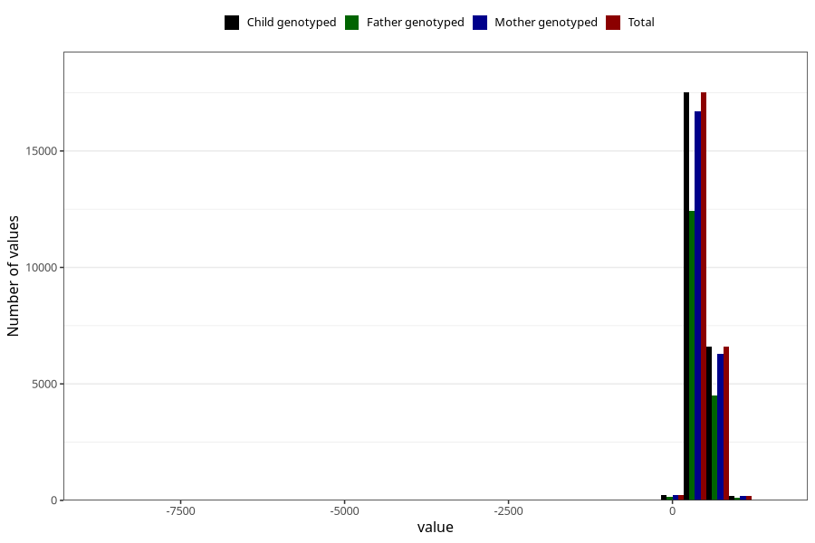

# age_16m
Variable created during phenotype curation.
- Number of values:

| Value | Total | Child genotyped | Mother genotyped | Father genotyped |
| ----- | ----- | --------------- | ---------------- | ---------------- |
| Missing | 50742 | 50742 | 48218 | 32849 |
| Non-missing | 24566 | 24566 | 23432 | 17235 |
| 25th percentile | 460 | 460 | 460 | 459 |
| 50th percentile | 474 | 474 | 474 | 473 |
| 75th percentile | 526 | 526 | 526 | 523 |
| Mean | 489.091915655784 | 489.091915655784 | 489.026374189143 | 488.290455468523 |
| Standard deviation | 109.485270626706 | 109.485270626706 | 110.410373547332 | 115.594525091661 |
| N | 24566 | 24566 | 23432 | 17235 |

