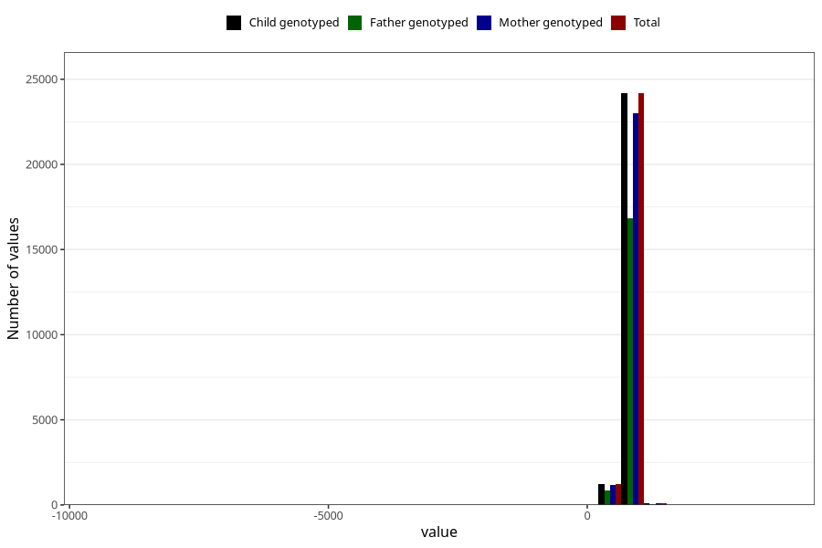

# age_2y
Variable mapping to `Q6_AGE_2_Y` in `Skjema6_3aar_v12`.
- Number of values:

| Value | Total | Child genotyped | Mother genotyped | Father genotyped |
| ----- | ----- | --------------- | ---------------- | ---------------- |
| Missing | 49784 | 49784 | 47331 | 32311 |
| Non-missing | 25524 | 25524 | 24319 | 17773 |
| 25th percentile | 734 | 734 | 734 | 734 |
| 50th percentile | 759 | 759 | 759 | 761 |
| 75th percentile | 806 | 806 | 806 | 808 |
| Mean | 768.043096693308 | 768.043096693308 | 767.857107611333 | 769.361390873797 |
| Standard deviation | 114.539301211013 | 114.539301211013 | 115.537545926992 | 92.6178835268838 |
| N | 25524 | 25524 | 24319 | 17773 |

