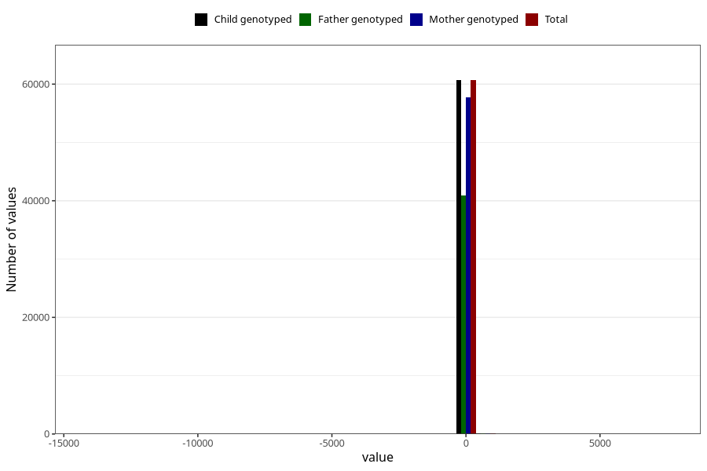

# age_6m
Variable mapping to `ALDER6MND_SJEKK` in `Skjema4_6mnd_v12`.
- Number of values:

| Value | Total | Child genotyped | Mother genotyped | Father genotyped |
| ----- | ----- | --------------- | ---------------- | ---------------- |
| Missing | 14499 | 14499 | 13753 | 9118 |
| Non-missing | 60809 | 60809 | 57897 | 40966 |
| 25th percentile | 167 | 167 | 167 | 167 |
| 50th percentile | 181 | 181 | 181 | 181 |
| 75th percentile | 187 | 187 | 187 | 187 |
| Mean | 172.762403591574 | 172.762403591574 | 172.707825966803 | 172.113215837524 |
| Standard deviation | 127.085800430579 | 127.085800430579 | 129.92266818977 | 137.310366234059 |
| N | 60809 | 60809 | 57897 | 40966 |

