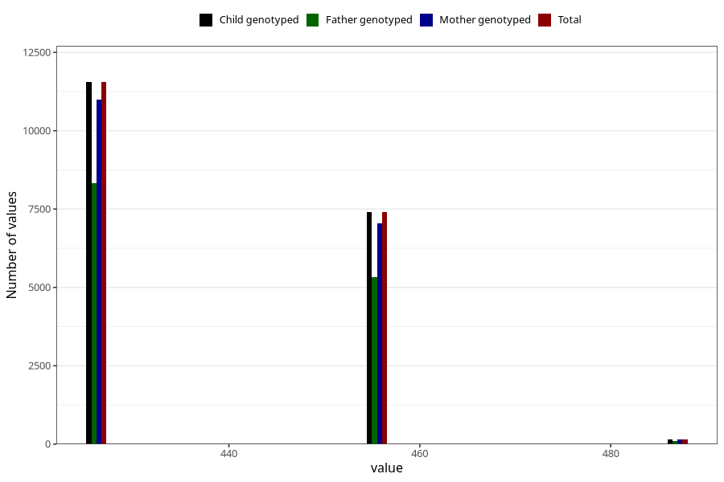

# age_answering_q_14c
Variable mapping to `AGE_YRS_UB` in `Ungdomsskjema_Barn_v12_standard`.
- Number of values:

| Value | Total | Child genotyped | Mother genotyped | Father genotyped |
| ----- | ----- | --------------- | ---------------- | ---------------- |
| Missing | 56192 | 56192 | 53471 | 36309 |
| Non-missing | 19116 | 19116 | 18179 | 13775 |
| 426.125 | 11551 | 11551 | 10980 | 8334 |
| 456.5625 | 7403 | 7403 | 7050 | 5335 |
| 487 | 162 | 162 | 149 | 106 |

