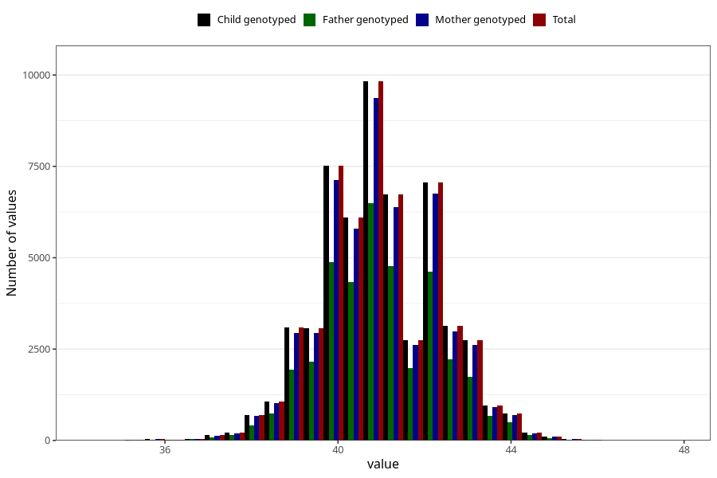

# hc_3m
Variable mapping to `DD220` in `Skjema4_6mnd_v12`.
- Number of values:

| Value | Total | Child genotyped | Mother genotyped | Father genotyped |
| ----- | ----- | --------------- | ---------------- | ---------------- |
| Missing | 19002 | 19002 | 18045 | 12071 |
| Non-missing | 56306 | 56306 | 53605 | 38013 |
| 25th percentile | 40 | 40 | 40 | 40 |
| 50th percentile | 41 | 41 | 41 | 41 |
| 75th percentile | 42 | 42 | 42 | 42 |
| Mean | 40.9823091677619 | 40.9823091677619 | 40.9822665796101 | 40.9925683318865 |
| Standard deviation | 1.32499050006904 | 1.32499050006904 | 1.32561864993769 | 1.3163851631505 |
| N | 56306 | 56306 | 53605 | 38013 |

