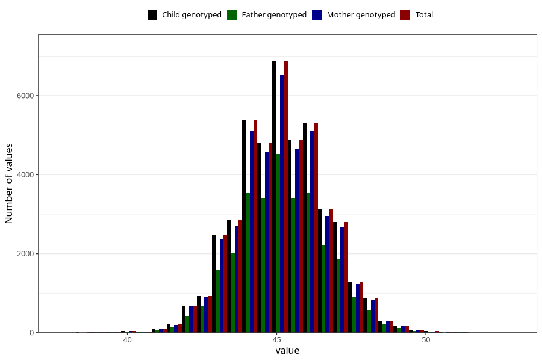

# hc_8m
Variable mapping to `EE388` in `Skjema5_18mnd_v12`.
- Number of values:

| Value | Total | Child genotyped | Mother genotyped | Father genotyped |
| ----- | ----- | --------------- | ---------------- | ---------------- |
| Missing | 32022 | 32022 | 30435 | 20708 |
| Non-missing | 43286 | 43286 | 41215 | 29376 |
| 25th percentile | 44 | 44 | 44 | 44 |
| 50th percentile | 45 | 45 | 45 | 45 |
| 75th percentile | 46 | 46 | 46 | 46 |
| Mean | 45.1332671071478 | 45.1332671071478 | 45.1358607303166 | 45.143828295207 |
| Standard deviation | 1.45526949247581 | 1.45526949247581 | 1.45571913788002 | 1.44918772341593 |
| N | 43286 | 43286 | 41215 | 29376 |

