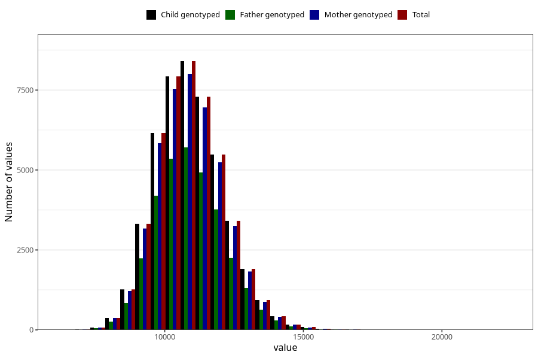

# weight_15_18m_1
Variable mapping to `EE398` in `Skjema5_18mnd_v12`.
- Number of values:

| Value | Total | Child genotyped | Mother genotyped | Father genotyped |
| ----- | ----- | --------------- | ---------------- | ---------------- |
| Missing | 28001 | 28001 | 26584 | 18044 |
| Non-missing | 47307 | 47307 | 45066 | 32040 |
| 25th percentile | 10070 | 10070 | 10070 | 10080 |
| 50th percentile | 10875 | 10875 | 10880 | 10880 |
| 75th percentile | 11700 | 11700 | 11700 | 11700 |
| Mean | 10933.0292979897 | 10933.0292979897 | 10932.8364398882 | 10934.4824282147 |
| Standard deviation | 1218.73439194242 | 1218.73439194242 | 1219.57668671677 | 1214.9507911914 |
| N | 47307 | 47307 | 45066 | 32040 |

