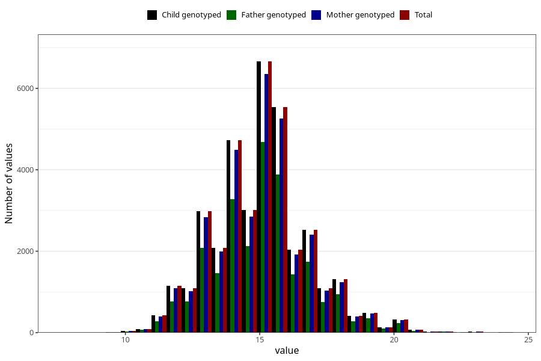

# weight_3y
Variable mapping to `GG26` in `Skjema6_3aar_v12`.
- Number of values:

| Value | Total | Child genotyped | Mother genotyped | Father genotyped |
| ----- | ----- | --------------- | ---------------- | ---------------- |
| Missing | 38982 | 38982 | 37153 | 24726 |
| Non-missing | 36326 | 36326 | 34497 | 25358 |
| 25th percentile | 14 | 14 | 14 | 14 |
| 50th percentile | 15 | 15 | 15 | 15 |
| 75th percentile | 16 | 16 | 16 | 16 |
| Mean | 15.0684135330067 | 15.0684135330067 | 15.0684955213497 | 15.0771125483082 |
| Standard deviation | 1.79370921731506 | 1.79370921731506 | 1.79374111316312 | 1.78904200650864 |
| N | 36326 | 36326 | 34497 | 25358 |

