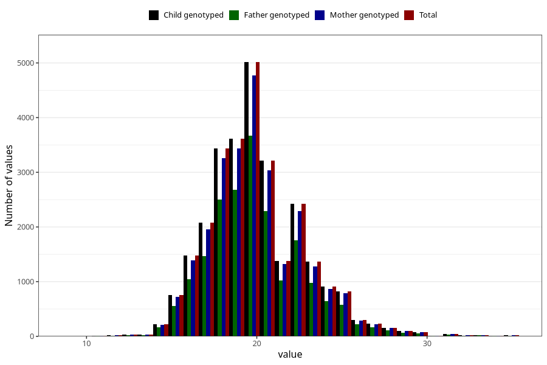

# weight_5y
Variable mapping to `LL13` in `Skjema5aar_v12`.
- Number of values:

| Value | Total | Child genotyped | Mother genotyped | Father genotyped |
| ----- | ----- | --------------- | ---------------- | ---------------- |
| Missing | 47516 | 47516 | 45305 | 29968 |
| Non-missing | 27792 | 27792 | 26345 | 20116 |
| 25th percentile | 18 | 18 | 18 | 18 |
| 50th percentile | 20 | 20 | 20 | 20 |
| 75th percentile | 21.5 | 21.5 | 21.5 | 21.5 |
| Mean | 20.0057498560737 | 20.0057498560737 | 20.011755551338 | 19.9926227878306 |
| Standard deviation | 2.84326680759048 | 2.84326680759048 | 2.8504691204903 | 2.82363559665288 |
| N | 27792 | 27792 | 26345 | 20116 |

