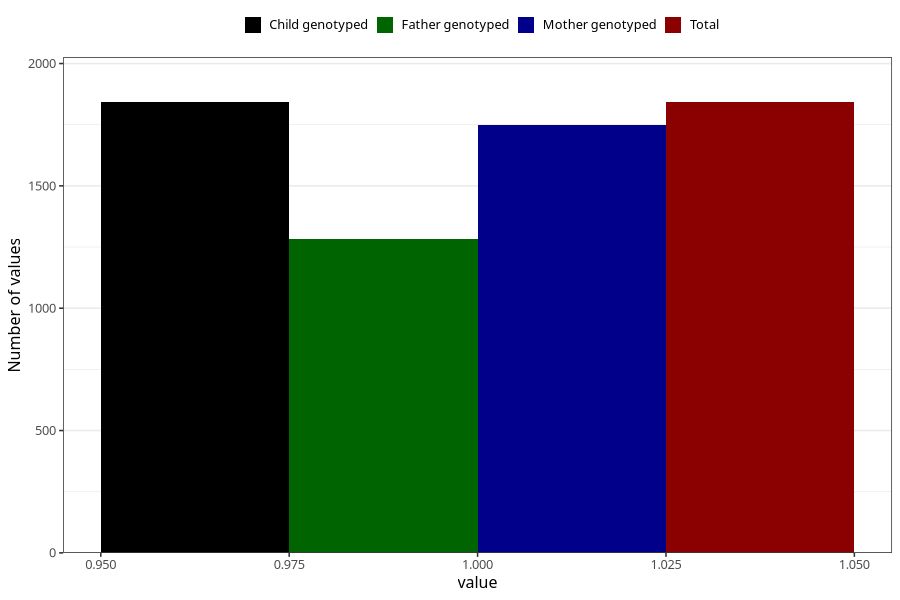

# accidental_injury_with_subsequent_medical_treatment_8y
Variable mapping to `NN32` in `Skjema8aar_v12`.
- Number of values:

| Value | Total | Child genotyped | Mother genotyped | Father genotyped |
| ----- | ----- | --------------- | ---------------- | ---------------- |
| Missing | 73466 | 73466 | 69902 | 48803 |
| Non-missing | 1842 | 1842 | 1748 | 1281 |
| 1 | 1842 | 1842 | 1748 | 1281 |

