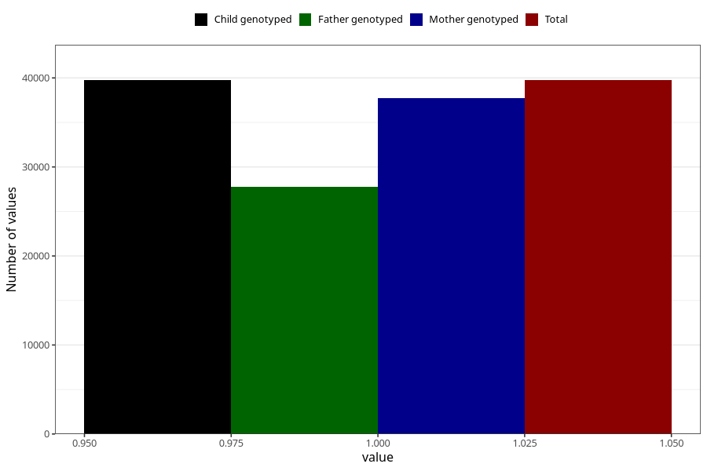

# allergy_affecing_eyes_nose_no_3y
Variable mapping to `GG73` in `Skjema6_3aar_v12`.
- Number of values:

| Value | Total | Child genotyped | Mother genotyped | Father genotyped |
| ----- | ----- | --------------- | ---------------- | ---------------- |
| Missing | 35566 | 35566 | 33876 | 22355 |
| Non-missing | 39742 | 39742 | 37774 | 27729 |
| 1 | 39742 | 39742 | 37774 | 27729 |

