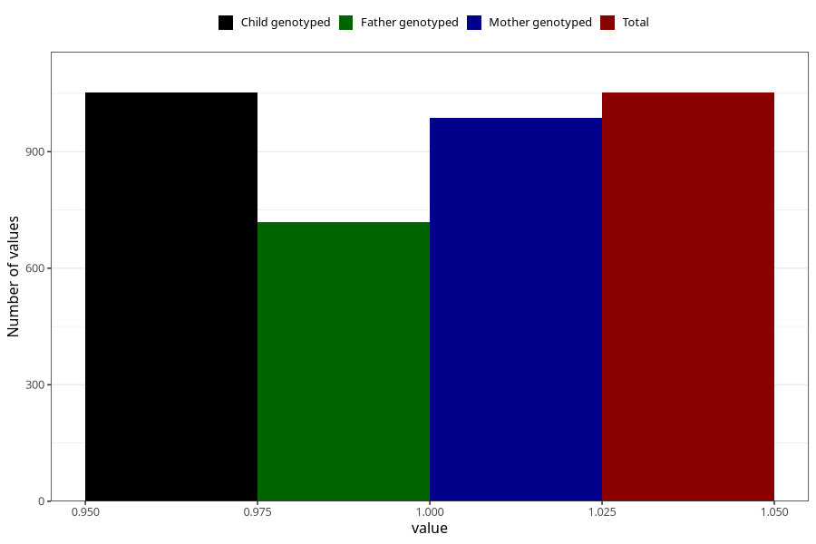

# allergy_affecing_eyes_nose_yes_3y
Variable mapping to `GG74` in `Skjema6_3aar_v12`.
- Number of values:

| Value | Total | Child genotyped | Mother genotyped | Father genotyped |
| ----- | ----- | --------------- | ---------------- | ---------------- |
| Missing | 74256 | 74256 | 70662 | 49366 |
| Non-missing | 1052 | 1052 | 988 | 718 |
| 1 | 1052 | 1052 | 988 | 718 |

