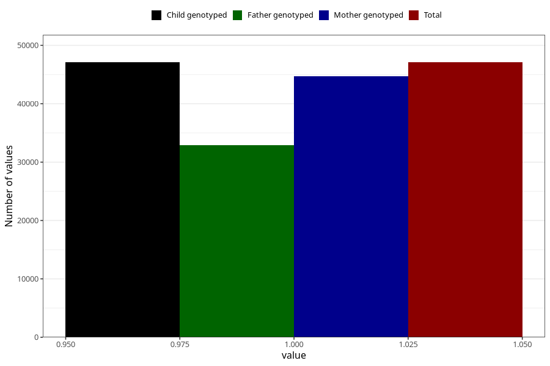

# asthma_no_18m
Variable mapping to `EE823` in `Skjema5_18mnd_v12`.
- Number of values:

| Value | Total | Child genotyped | Mother genotyped | Father genotyped |
| ----- | ----- | --------------- | ---------------- | ---------------- |
| Missing | 28218 | 28218 | 26913 | 17138 |
| Non-missing | 47090 | 47090 | 44737 | 32946 |
| 1 | 47090 | 47090 | 44737 | 32946 |

