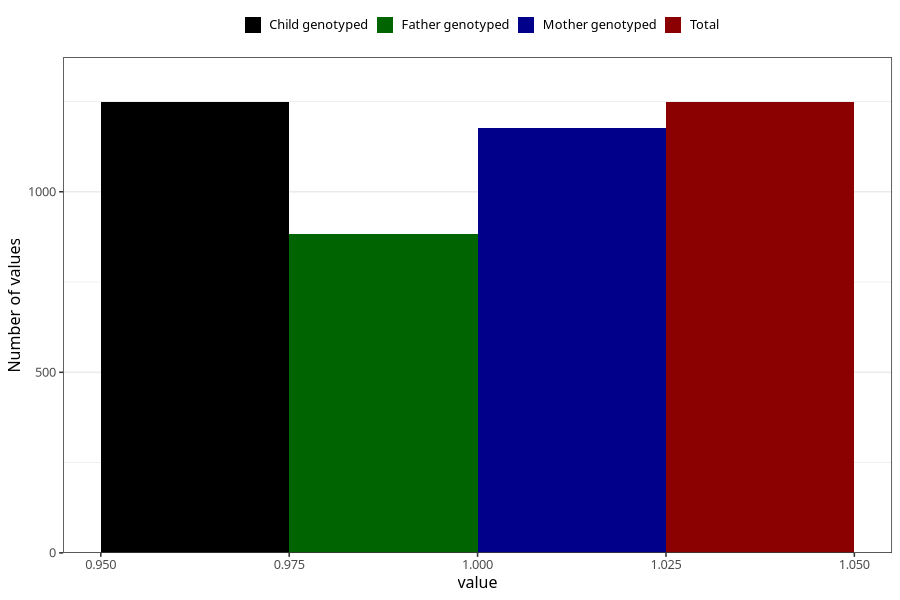

# asthma_previous_3y
Variable mapping to `GG71` in `Skjema6_3aar_v12`.
- Number of values:

| Value | Total | Child genotyped | Mother genotyped | Father genotyped |
| ----- | ----- | --------------- | ---------------- | ---------------- |
| Missing | 74060 | 74060 | 70473 | 49201 |
| Non-missing | 1248 | 1248 | 1177 | 883 |
| 1 | 1248 | 1248 | 1177 | 883 |

