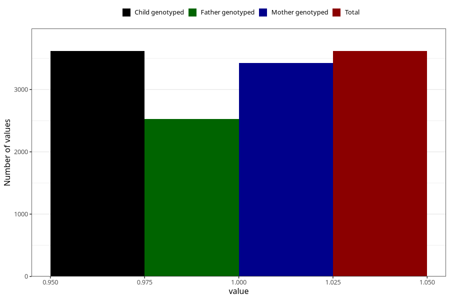

# atopic_eczema_previous_3y
Variable mapping to `GG79` in `Skjema6_3aar_v12`.
- Number of values:

| Value | Total | Child genotyped | Mother genotyped | Father genotyped |
| ----- | ----- | --------------- | ---------------- | ---------------- |
| Missing | 71691 | 71691 | 68222 | 47557 |
| Non-missing | 3617 | 3617 | 3428 | 2527 |
| 1 | 3617 | 3617 | 3428 | 2527 |

