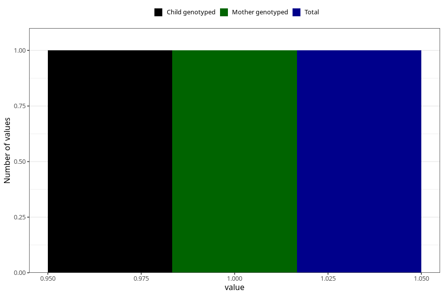

# autistic_traits_yes_3y
Variable mapping to `GG102` in `Skjema6_3aar_v12`.
- Number of values:

| Value | Total | Child genotyped | Mother genotyped | Father genotyped |
| ----- | ----- | --------------- | ---------------- | ---------------- |
| Missing | 75307 | 75307 | 71649 | 50084 |
| Non-missing | 1 | 1 | 1 | 0 |
| 1 | 1 | 1 | 1 | 0 |

