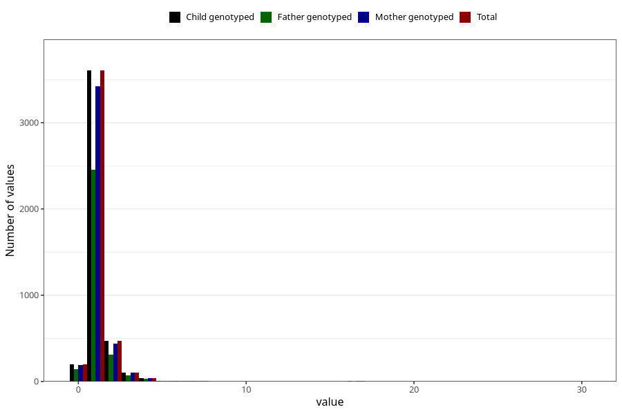

# bronchitis_rs_pneumonia_number_12_18m
Variable mapping to `EE238` in `Skjema5_18mnd_v12`.
- Number of values:

| Value | Total | Child genotyped | Mother genotyped | Father genotyped |
| ----- | ----- | --------------- | ---------------- | ---------------- |
| Missing | 70859 | 70859 | 67433 | 47070 |
| Non-missing | 4449 | 4449 | 4217 | 3014 |
| 0 | 196 | 196 | 189 | 141 |
| 1 | 3605 | 3605 | 3421 | 2451 |
| 2 | 471 | 471 | 436 | 309 |
| 3 | 104 | 104 | 103 | 69 |
| 4 | 37 | 37 | 35 | 27 |
| 5 | 10 | 10 | 10 | 4 |
| 6 | 6 | 6 | 6 | 3 |
| 7 | 5 | 5 | 4 | 3 |
| 9 | 1 | 1 | 1 | 1 |
| 10 | 2 | 2 | 2 | 1 |
| 14 | 2 | 2 | 2 | 1 |
| 16 | 1 | 1 | 1 | 0 |
| 17 | 6 | 6 | 5 | 2 |
| 18 | 2 | 2 | 1 | 1 |
| 30 | 1 | 1 | 1 | 1 |

