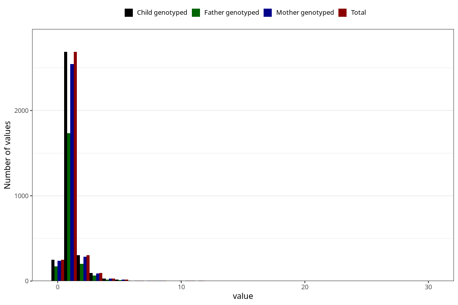

# bronchitis_rs_pneumonia_number_6_11m
Variable mapping to `EE236` in `Skjema5_18mnd_v12`.
- Number of values:

| Value | Total | Child genotyped | Mother genotyped | Father genotyped |
| ----- | ----- | --------------- | ---------------- | ---------------- |
| Missing | 71912 | 71912 | 68427 | 47873 |
| Non-missing | 3396 | 3396 | 3223 | 2211 |
| 0 | 248 | 248 | 238 | 175 |
| 1 | 2687 | 2687 | 2546 | 1736 |
| 2 | 301 | 301 | 287 | 200 |
| 3 | 93 | 93 | 87 | 64 |
| 4 | 28 | 28 | 27 | 15 |
| 5 | 17 | 17 | 17 | 11 |
| 6 | 7 | 7 | 6 | 2 |
| 7 | 3 | 3 | 3 | 0 |
| 8 | 5 | 5 | 5 | 4 |
| 10 | 3 | 3 | 3 | 1 |
| 11 | 3 | 3 | 3 | 2 |
| 30 | 1 | 1 | 1 | 1 |

