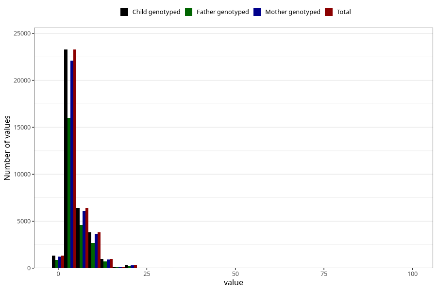

# common_cold_freq_3y
Variable mapping to `GG129` in `Skjema6_3aar_v12`.
- Number of values:

| Value | Total | Child genotyped | Mother genotyped | Father genotyped |
| ----- | ----- | --------------- | ---------------- | ---------------- |
| Missing | 38974 | 38974 | 37158 | 24801 |
| Non-missing | 36334 | 36334 | 34492 | 25283 |
| 25th percentile | 3 | 3 | 3 | 3 |
| 50th percentile | 4 | 4 | 4 | 4 |
| 75th percentile | 6 | 6 | 6 | 6 |
| Mean | 5.26831617768481 | 5.26831617768481 | 5.26064014844022 | 5.31649725111735 |
| Standard deviation | 4.19524321808292 | 4.19524321808292 | 4.1551442957298 | 4.1037846596059 |
| N | 36334 | 36334 | 34492 | 25283 |

