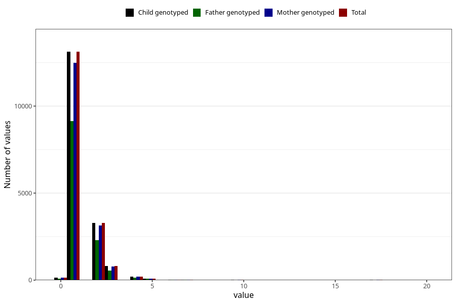

# conjunctivitis_number_12_18m
Variable mapping to `EE253` in `Skjema5_18mnd_v12`.
- Number of values:

| Value | Total | Child genotyped | Mother genotyped | Father genotyped |
| ----- | ----- | --------------- | ---------------- | ---------------- |
| Missing | 57528 | 57528 | 54708 | 37706 |
| Non-missing | 17780 | 17780 | 16942 | 12378 |
| Filled in text or mark instead of number | 1 | 1 | 1 |0 |
| 25th percentile | 1 | 1 | 1 | 1 |
| 50th percentile | 1 | 1 | 1 | 1 |
| 75th percentile | 2 | 2 | 2 | 2 |
| Mean | 1.39136059395917 | 1.39136059395917 | 1.39336520866537 | 1.39828728389077 |
| Standard deviation | 1.08422744900104 | 1.08422744900104 | 1.08729417977832 | 1.11453063304166 |
| N | 17779 | 17779 | 16941 | 12378 |

