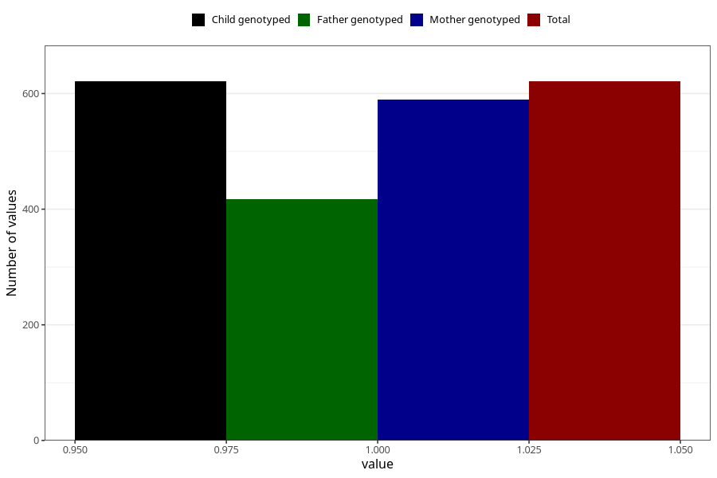

# delayed_motor_development_previous_3y
Variable mapping to `GG39` in `Skjema6_3aar_v12`.
- Number of values:

| Value | Total | Child genotyped | Mother genotyped | Father genotyped |
| ----- | ----- | --------------- | ---------------- | ---------------- |
| Missing | 74687 | 74687 | 71061 | 49667 |
| Non-missing | 621 | 621 | 589 | 417 |
| 1 | 621 | 621 | 589 | 417 |

