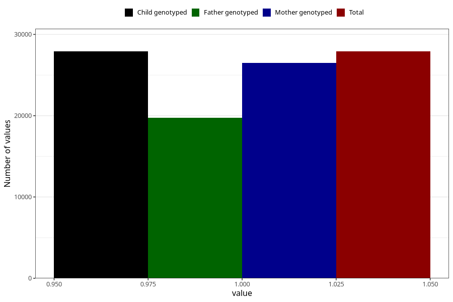

# delayed_or_abnormal_language_development_no_8y
Variable mapping to `NN40` in `Skjema8aar_v12`.
- Number of values:

| Value | Total | Child genotyped | Mother genotyped | Father genotyped |
| ----- | ----- | --------------- | ---------------- | ---------------- |
| Missing | 47403 | 47403 | 45158 | 30310 |
| Non-missing | 27905 | 27905 | 26492 | 19774 |
| 1 | 27905 | 27905 | 26492 | 19774 |

