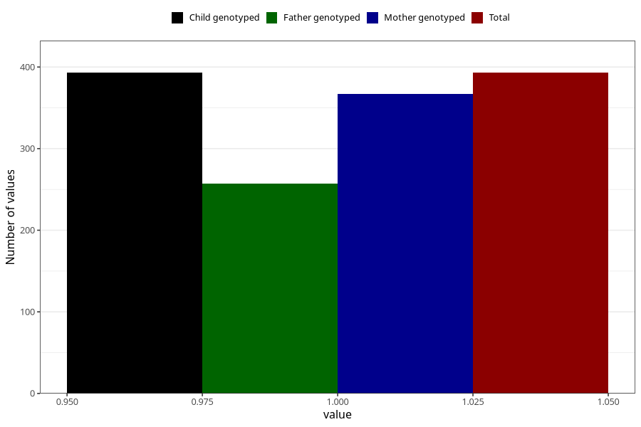

# delayed_speech_development_yes_18m
Variable mapping to `EE840` in `Skjema5_18mnd_v12`.
- Number of values:

| Value | Total | Child genotyped | Mother genotyped | Father genotyped |
| ----- | ----- | --------------- | ---------------- | ---------------- |
| Missing | 74915 | 74915 | 71283 | 49827 |
| Non-missing | 393 | 393 | 367 | 257 |
| 1 | 393 | 393 | 367 | 257 |

