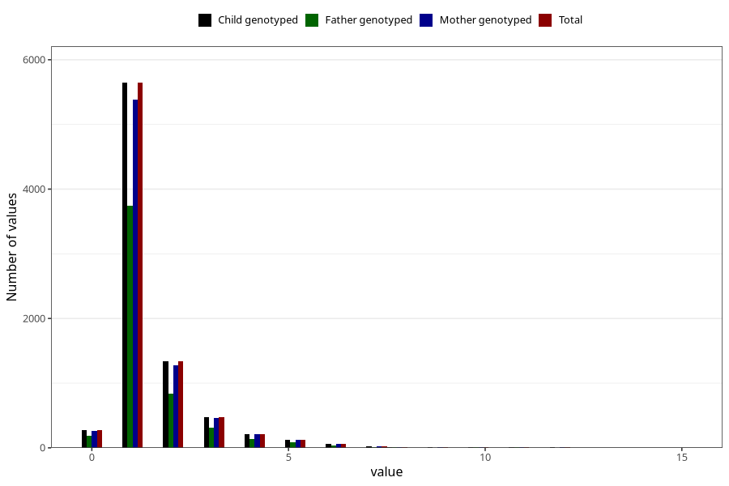

# ear_infection_number_6_11m
Variable mapping to `EE226` in `Skjema5_18mnd_v12`.
- Number of values:

| Value | Total | Child genotyped | Mother genotyped | Father genotyped |
| ----- | ----- | --------------- | ---------------- | ---------------- |
| Missing | 67089 | 67089 | 63796 | 44694 |
| Non-missing | 8219 | 8219 | 7854 | 5390 |
| 0 | 273 | 273 | 263 | 192 |
| 1 | 5644 | 5644 | 5385 | 3743 |
| 2 | 1338 | 1338 | 1278 | 843 |
| 3 | 480 | 480 | 461 | 314 |
| 4 | 217 | 217 | 211 | 139 |
| 5 | 129 | 129 | 122 | 82 |
| 6 | 61 | 61 | 58 | 34 |
| 7 | 28 | 28 | 27 | 16 |
| 8 | 17 | 17 | 17 | 7 |
| 9 | 6 | 6 | 6 | 4 |
| 10 | 14 | 14 | 14 | 7 |
| 11 | 6 | 6 | 6 | 5 |
| 12 | 5 | 5 | 5 | 3 |
| 15 | 1 | 1 | 1 | 1 |

