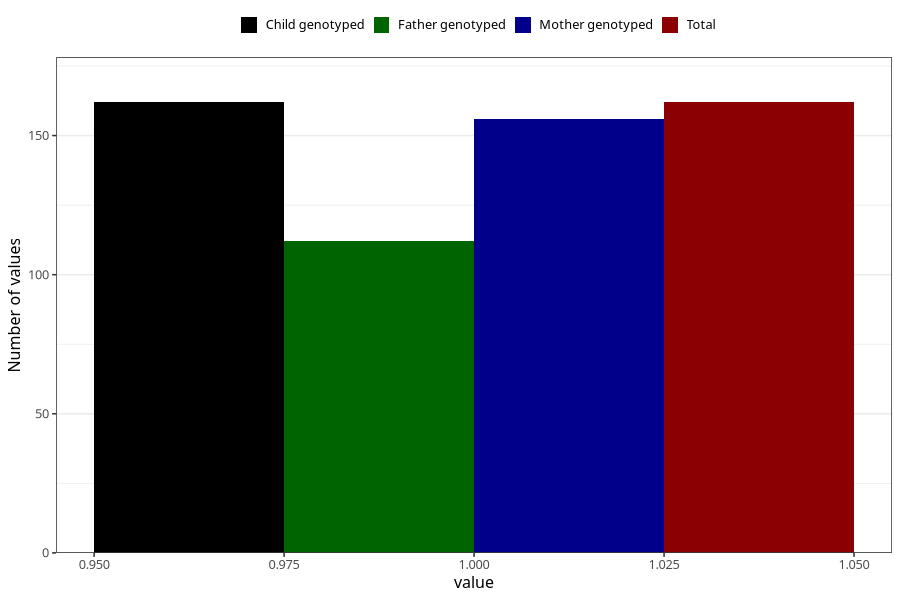

# epilepsy_7y
Variable mapping to `JJ434` in `Skjema7aar_v12`.
- Number of values:

| Value | Total | Child genotyped | Mother genotyped | Father genotyped |
| ----- | ----- | --------------- | ---------------- | ---------------- |
| Missing | 75146 | 75146 | 71494 | 49972 |
| Non-missing | 162 | 162 | 156 | 112 |
| 1 | 162 | 162 | 156 | 112 |

