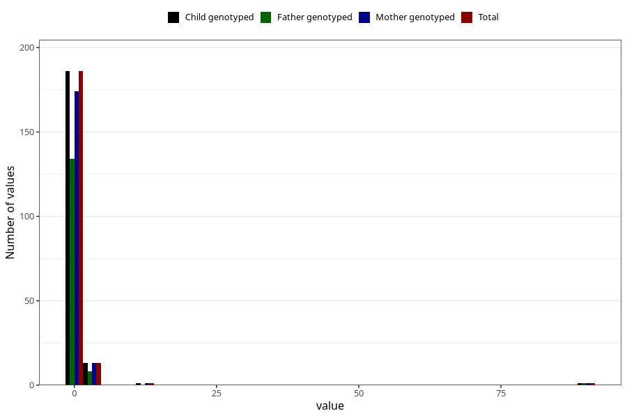

# febrile_convulsions_freq_6m
Variable mapping to `DD296` in `Skjema4_6mnd_v12`.
- Number of values:

| Value | Total | Child genotyped | Mother genotyped | Father genotyped |
| ----- | ----- | --------------- | ---------------- | ---------------- |
| Missing | 75107 | 75107 | 71461 | 49941 |
| Non-missing | 201 | 201 | 189 | 143 |
| 0 | 86 | 86 | 81 | 65 |
| 1 | 100 | 100 | 93 | 69 |
| 2 | 11 | 11 | 11 | 7 |
| 3 | 1 | 1 | 1 | 1 |
| 4 | 1 | 1 | 1 | 0 |
| 11 | 1 | 1 | 1 | 0 |
| 90 | 1 | 1 | 1 | 1 |

