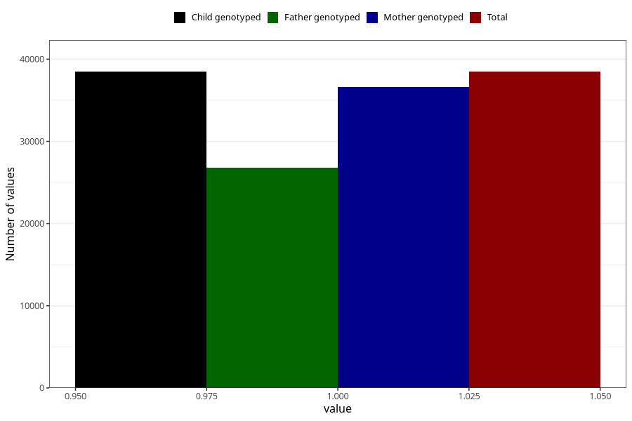

# food_allergy_no_3y
Variable mapping to `GG85` in `Skjema6_3aar_v12`.
- Number of values:

| Value | Total | Child genotyped | Mother genotyped | Father genotyped |
| ----- | ----- | --------------- | ---------------- | ---------------- |
| Missing | 36831 | 36831 | 35077 | 23253 |
| Non-missing | 38477 | 38477 | 36573 | 26831 |
| 1 | 38477 | 38477 | 36573 | 26831 |

