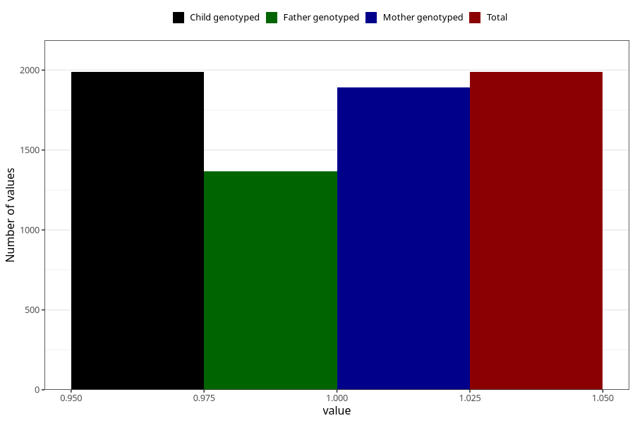

# food_allergy_yes_3y
Variable mapping to `GG86` in `Skjema6_3aar_v12`.
- Number of values:

| Value | Total | Child genotyped | Mother genotyped | Father genotyped |
| ----- | ----- | --------------- | ---------------- | ---------------- |
| Missing | 73320 | 73320 | 69758 | 48719 |
| Non-missing | 1988 | 1988 | 1892 | 1365 |
| 1 | 1988 | 1988 | 1892 | 1365 |

