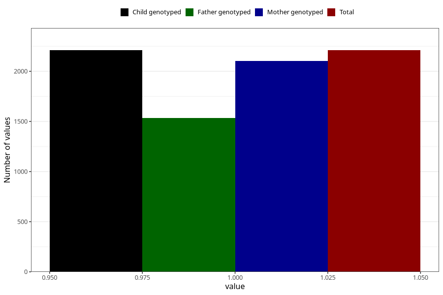

# fracture_injuries_7y
Variable mapping to `JJ433` in `Skjema7aar_v12`.
- Number of values:

| Value | Total | Child genotyped | Mother genotyped | Father genotyped |
| ----- | ----- | --------------- | ---------------- | ---------------- |
| Missing | 73098 | 73098 | 69545 | 48551 |
| Non-missing | 2210 | 2210 | 2105 | 1533 |
| 1 | 2210 | 2210 | 2105 | 1533 |

