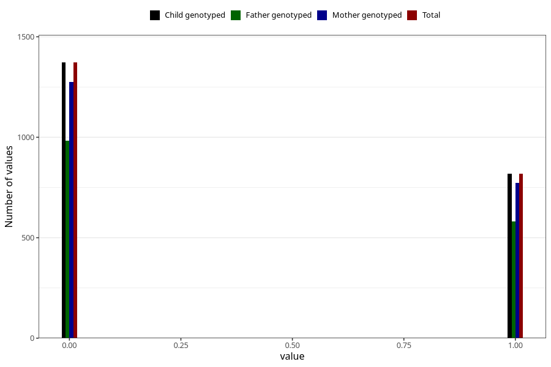

# frequent_stomach_pain_previous_3y
Variable mapping to `GG572` in `Skjema6_3aar_v12`.
- Number of values:

| Value | Total | Child genotyped | Mother genotyped | Father genotyped |
| ----- | ----- | --------------- | ---------------- | ---------------- |
| Missing | 73117 | 73117 | 69602 | 48521 |
| Non-missing | 2191 | 2191 | 2048 | 1563 |
| 0 | 1372 | 1372 | 1274 | 982 |
| 1 | 819 | 819 | 774 | 581 |

