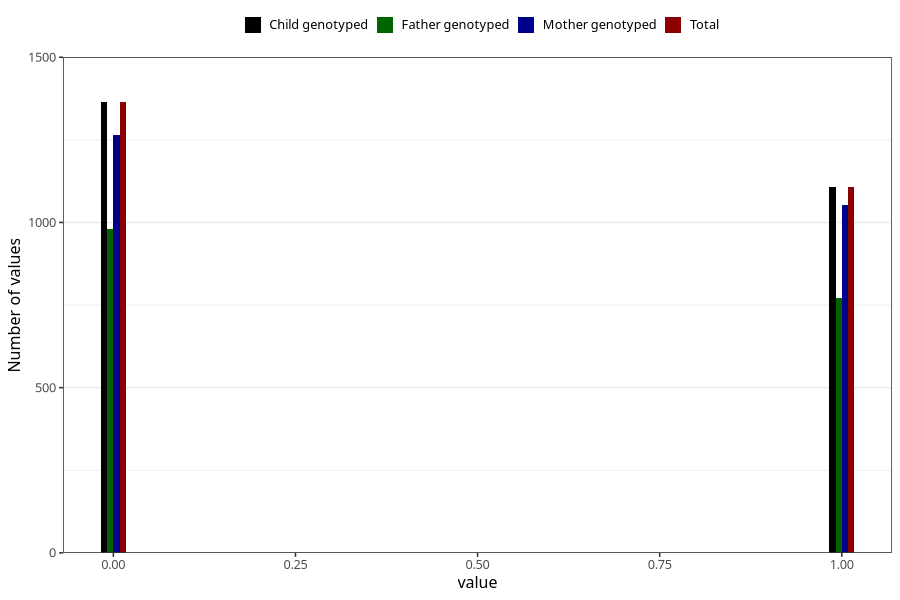

# frequent_stomach_pain_yes_3y
Variable mapping to `GG571` in `Skjema6_3aar_v12`.
- Number of values:

| Value | Total | Child genotyped | Mother genotyped | Father genotyped |
| ----- | ----- | --------------- | ---------------- | ---------------- |
| Missing | 72838 | 72838 | 69333 | 48334 |
| Non-missing | 2470 | 2470 | 2317 | 1750 |
| 0 | 1364 | 1364 | 1264 | 980 |
| 1 | 1106 | 1106 | 1053 | 770 |

