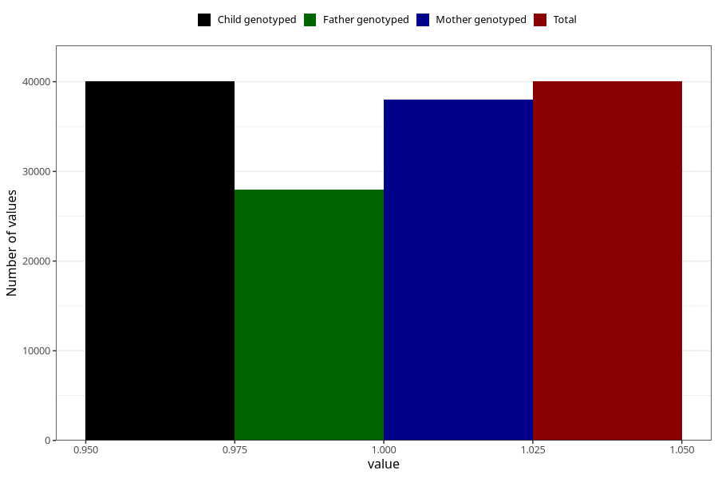

# gained_too_little_weight_no_3y
Variable mapping to `GG53` in `Skjema6_3aar_v12`.
- Number of values:

| Value | Total | Child genotyped | Mother genotyped | Father genotyped |
| ----- | ----- | --------------- | ---------------- | ---------------- |
| Missing | 35275 | 35275 | 33610 | 22154 |
| Non-missing | 40033 | 40033 | 38040 | 27930 |
| 1 | 40033 | 40033 | 38040 | 27930 |

