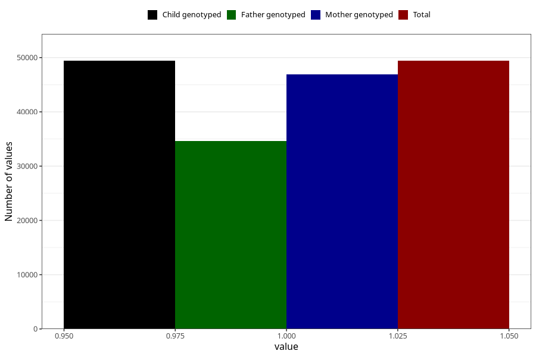

# heart_defect_no_18m
Variable mapping to `EE815` in `Skjema5_18mnd_v12`.
- Number of values:

| Value | Total | Child genotyped | Mother genotyped | Father genotyped |
| ----- | ----- | --------------- | ---------------- | ---------------- |
| Missing | 25902 | 25902 | 24695 | 15466 |
| Non-missing | 49406 | 49406 | 46955 | 34618 |
| 1 | 49406 | 49406 | 46955 | 34618 |

