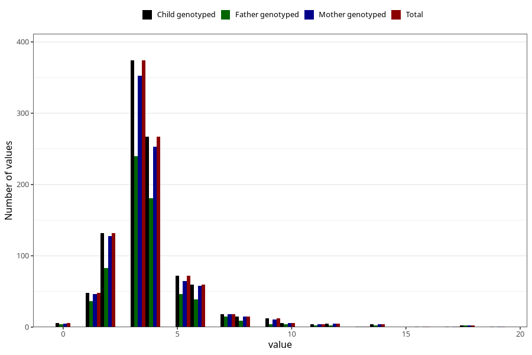

# hip_treated_cushion_duration_18m
Variable mapping to `EE214` in `Skjema5_18mnd_v12`.
- Number of values:

| Value | Total | Child genotyped | Mother genotyped | Father genotyped |
| ----- | ----- | --------------- | ---------------- | ---------------- |
| Missing | 74279 | 74279 | 70673 | 49414 |
| Non-missing | 1029 | 1029 | 977 | 670 |
| 0 | 6 | 6 | 5 | 4 |
| 1 | 48 | 48 | 46 | 36 |
| 2 | 132 | 132 | 128 | 83 |
| 3 | 374 | 374 | 353 | 240 |
| 4 | 267 | 267 | 253 | 181 |
| 5 | 72 | 72 | 65 | 46 |
| 6 | 60 | 60 | 58 | 39 |
| 7 | 18 | 18 | 18 | 15 |
| 8 | 15 | 15 | 15 | 9 |
| 9 | 12 | 12 | 11 | 4 |
| 10 | 6 | 6 | 6 | 4 |
| 11 | 4 | 4 | 4 | 2 |
| 12 | 5 | 5 | 5 | 2 |
| 13 | 1 | 1 | 1 | 1 |
| 14 | 4 | 4 | 4 | 2 |
| 16 | 1 | 1 | 1 | 0 |
| 17 | 1 | 1 | 1 | 0 |
| 18 | 2 | 2 | 2 | 2 |
| 19 | 1 | 1 | 1 | 0 |

