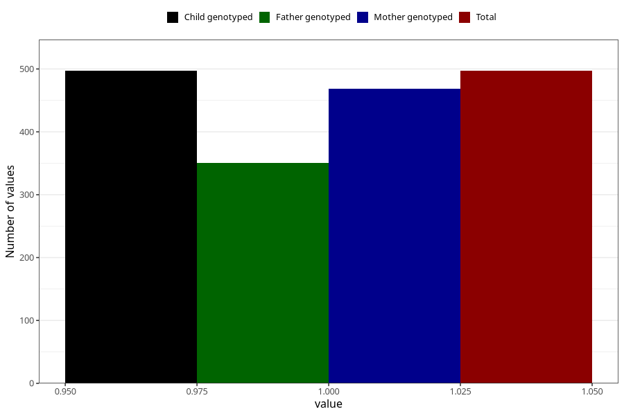

# impaired_hearing_previously_18m
Variable mapping to `EE793` in `Skjema5_18mnd_v12`.
- Number of values:

| Value | Total | Child genotyped | Mother genotyped | Father genotyped |
| ----- | ----- | --------------- | ---------------- | ---------------- |
| Missing | 74811 | 74811 | 71181 | 49733 |
| Non-missing | 497 | 497 | 469 | 351 |
| 1 | 497 | 497 | 469 | 351 |

