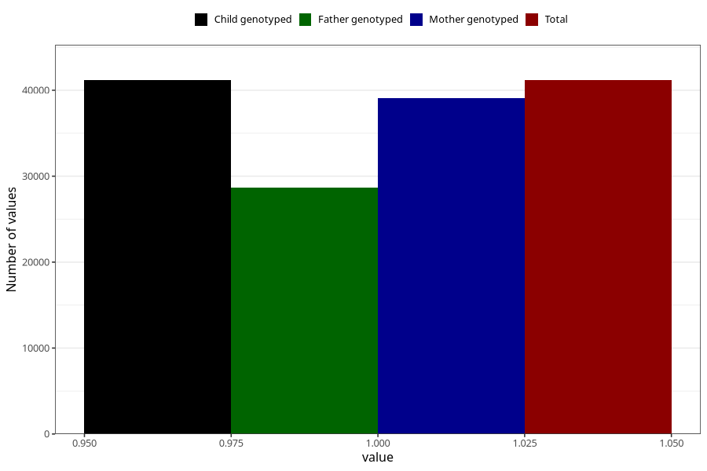

# impaired_vision_no_3y
Variable mapping to `GG33` in `Skjema6_3aar_v12`.
- Number of values:

| Value | Total | Child genotyped | Mother genotyped | Father genotyped |
| ----- | ----- | --------------- | ---------------- | ---------------- |
| Missing | 34140 | 34140 | 32542 | 21423 |
| Non-missing | 41168 | 41168 | 39108 | 28661 |
| 1 | 41168 | 41168 | 39108 | 28661 |

