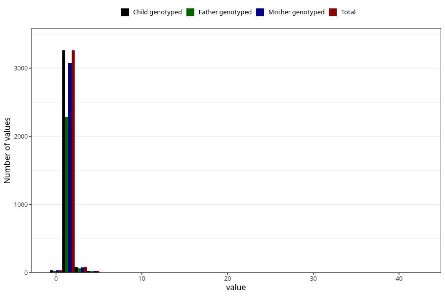

# injury_or_accident_freq_3y
Variable mapping to `GG165` in `Skjema6_3aar_v12`.
- Number of values:

| Value | Total | Child genotyped | Mother genotyped | Father genotyped |
| ----- | ----- | --------------- | ---------------- | ---------------- |
| Missing | 71893 | 71893 | 68429 | 47687 |
| Non-missing | 3415 | 3415 | 3221 | 2397 |
| 0 | 37 | 37 | 36 | 27 |
| 1 | 2769 | 2769 | 2613 | 1946 |
| 2 | 491 | 491 | 460 | 341 |
| 3 | 83 | 83 | 78 | 63 |
| 4 | 19 | 19 | 19 | 14 |
| 5 | 11 | 11 | 10 | 6 |
| 7 | 1 | 1 | 1 | 0 |
| 8 | 1 | 1 | 1 | 0 |
| 10 | 1 | 1 | 1 | 0 |
| 35 | 1 | 1 | 1 | 0 |
| 42 | 1 | 1 | 1 | 0 |

